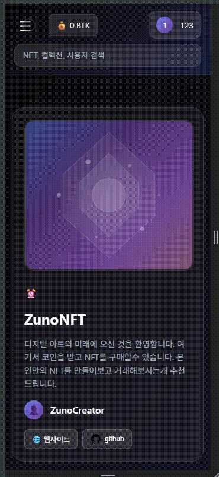

# ZunoNFT
<h2><a href="https://bing-nft.vercel.app/" style="color: lightblue;">ZunoNFT 사이트 이동</a></h2>

# 목차
- [프로젝트 소개](#프로젝트-소개)
- [개인 프로젝트](#팀원-소개)
- [화면 구성](#화면-구성)
- [주요 기능](#주요-기능)
- [개발 기간](#개발-기간)
- [기술 스택](#기술-스택)
- [협업 도구](#협업-도구-communication)
- [회고 로그](#회고-로그)
---

## 개발 기간
- 대략 일주

## 프로젝트 소개

ZunoNFT는 블록체인에서 계정 추상화 erc4337 로직 사용해서 사용자가 wallet 없이도 편하게 블록첸을 기능을 사용할수있고 TOKEN 발급이나 NFT 거래도 할수 있는 플랫품으로 개발하게 되었습니다. 

---

## 팀원 소개 

 
<a href="https://github.com/Mr-Binod">팀원 : 비노드 </a> 

## 화면 구성 
### desktop view
<label >회원 가입 (블록에 기록 되기때문에 시간 좀 소요됩니다)</label>   
  
<label>NFT 생성</label> 
  

### mobile view
<label>NFT 판매</label> 
  
<label>NFT 구매</label> 
 
<label>NFT 구매</label> 
 

## 주요 기능

### 담당 : Zuno 프로젝트

- 로그인 페이지 : 사용자가 회원가입하면 ERC4337로 wallet 생성해서 smart Account 생성 
- 메인 페이지 :메인 페이지에서 사용자 정보 아이디, 공개키, 잔액 확인 및 NFT 구매 가능. 사용자가 토큰 발행하면 1000BTK 발행 및 nft 생성 기능
- 마이 페이지 : 사용자의 정보, 소유하고 있는 NFT, 판매중이 NFT 확인하고 판매 NFT 취소 기능

## API 문서 

### 📥 GET 요청

| 메서드 | 경로 | 설명 |
|--------|------|------|
| GET | `/account` | 전체 계정 조회 |
| GET | `/account/:id` | 특정 ID의 사용자 계정 조회 |
| GET | `/userop` | mempool 조회 |
| GET | `/user/:user` | 특정 사용자의 NFT 조회 |
| GET | `/sellnft` | 판매 중인 NFT 리스트 조회 |
| GET | `/sellnft/:userid/:nftid` | 특정 사용자의 특정 NFT 조회 |

---

### 🛠 PATCH 요청

| 메서드 | 경로 | 설명 |
|--------|------|------|
| PATCH | `/sellnft` | 사용자의 구매한 NFT 추가 |

---

### ➕ POST 요청

| 메서드 | 경로 | 설명 |
|--------|------|------|
| POST | `/account` | 계정 생성 |
| POST | `/createnft` | NFT 생성 |
| POST | `/userop` | EntryPoint 호출 |
| POST | `/wallet` | 지갑 생성 |
| POST | `/nft` | NFT 생성 및 DB 저장 |
| POST | `/creteusernft` | 사용자 NFT 생성 및 DB 저장 |
| POST | `/sellnft` | NFT 판매 등록 |
| POST | `/contractsellnft` | 판매 컨트랙트 호출 |
| POST | `/buynft` | NFT 구매 |
| POST | `/contractbuynft` | 구매 컨트랙트 호출 |

---

### ❌ DELETE 요청

| 메서드 | 경로 | 설명 |
|--------|------|------|
| DELETE | `/sellnft` | 사용자의 판매 NFT 삭제 |
| DELETE | `/sellnftcontractsellnft` | 사용자의 판매 NFT를 컨트랙트에서 삭제 |
| DELETE | `/checkzero` | NFT 수량이 0이면 삭제 |

## 기술 스택 
### FRONTEND

### 🛠 BACKEND

### CONTRACT

### 협업 도구 COMMUNICATION 

### Library and test tools

#### FRONTEND
- react-query
- tanstack /react-query
- redux react-redux
- axios
- ethers
- dotenv

#### BACKEND
- crypto
- elliptic

test & contract deployment
1. remixd
2. hardhat

#### RPC
- INFURA
- PINATA

#### AI
- cursor
- chatgpt
- gemini

# 회고 로그 
<!-- - 프로젝트 목표, 계획, 구현, 유지보수, 회고 -->
### 구현
- ERC4337 블록체인 기능을 활용해서 토큰 발행, NFT 생성 및 거래할수 있는 플랫품을 개발하게 되었습니다.
- 사용자가 가입하면 WALLET 이랑 SMART ACCOUNT 계정을 생성되고 WHITE LIST 에 등록되어 WHITE LIST 등록 된 SMART CONTRACT 들의 GASFEE 대납자가 지불하게 됩니다
- 사용자의 정보, NFT정보, 판매 NFT LIST들이 DATABASE 에 저장하게 했습니다
- 백엔드는 NESTJS 사용했고 프론트는 REACT 사요하고 CONTRACT는 SOLIDITY 사용해서 구현하게 되었습니다.
- mainpage에서는 사용자의 포트폴리오, 거래 내역과 데시보드를 확인할수 있습니다.
- chain 에 논스 켭치기 않기 위해 컨트랙트 처리 될때까지 로딩 처리했습니다.
- 웹과 모바일 반응형도 처리해놨습니다.

### 문제점 및 해결
- ERC4337 사용해서 ERC1155 로직을 호출할때 에러가 발생했고 구현이 어려웠습니다
그래서 대납자 사용해서 ERC1155 컨트랙트를 호출하게 되었습니다
- NESTJS 사용해서 백엔드 구현할때 배우면서 해야되기때문에 어려움이 겪였습니다 
- ENV 로직 호출, 데이터베이스 설게, 의존성 주입, 타입 정의 같은 불편함을 저리하면서 환성하였습니다
- 회원 가입으나 거래할때 시간좀 걸리고 사용자가 이탈한 불편함
- aws 백엔트 배포할때 메모리가 부족해서 메모리 스왑해서 2GB 로 올리고 처리했습니다.
- cursor 사용할때 prompt 랑 디벙깅 하는개의 신경좀 썼습니다다

### 계획

- 스왑 기능 주가 예정
- 화면 디자인 더 예쁘게 디자인 할 예정
- 토큰 발행기능을 저움에 무료하고 3 번지나면 유로로 할 예정
- 거래가되면 수수료 확보할 예정 
- 추가 nft platform 의 필요한 기능들이 찾으면서 추가할 예정
- 카카오 로그인이랑 구굴 로그인 기능 추가 
